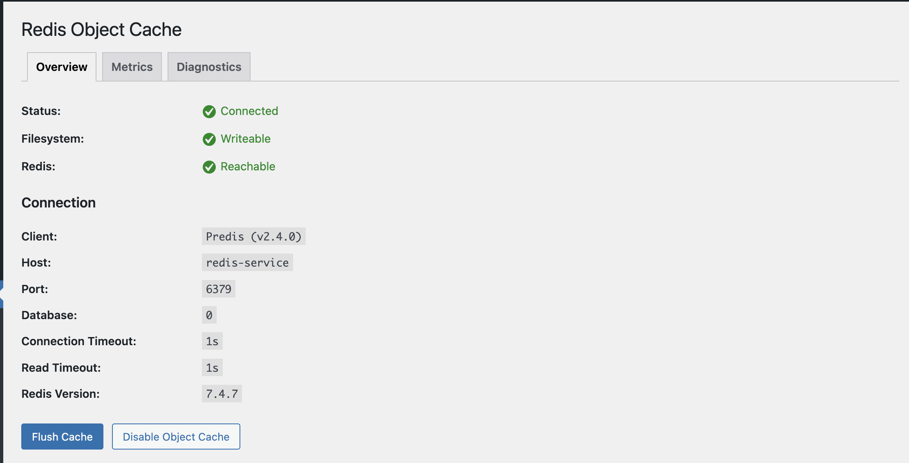
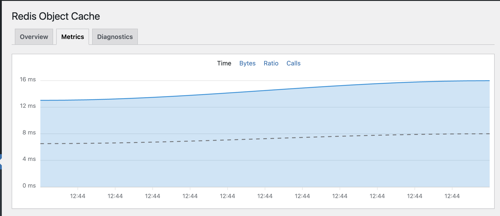

# WordPress on GKE Autopilot

Example WordPress deployment on Google Kubernetes Engine with Redis caching and Cloud SQL MySQL.

**Optimized for GCP Free Tier** - Works within 12 vCPU quota limits, perfect for trial users and learning.

## Architecture

```
Load Balancer (External IP)
    ↓
NGINX Ingress (sticky sessions)
    ↓
WordPress Pods (2 replicas)
    ├─ WordPress Container
    ├─ Cloud SQL Proxy Sidecar
    └─ Redis Cache
    ↓
Cloud SQL MySQL (managed)
```

## Prerequisites

- GKE Autopilot cluster (running)
- Cloud SQL MySQL instance (created)
- NGINX Ingress Controller (installed)
- Tools: `kubectl`, `gcloud`

## Quick Start

### 1. Configure Secrets

Copy and edit secrets file:
```bash
cp kubernetes/01-secrets.yaml.example kubernetes/01-secrets.yaml
```

Update with your Cloud SQL credentials:
```yaml
# kubernetes/01-secrets.yaml
stringData:
  DB_USER: "wordpress"
  DB_PASSWORD: "your-strong-password"
  DB_NAME: "wordpress"
  DB_HOST: "127.0.0.1:3306"
  INSTANCE_CONNECTION_NAME: "project:region:instance"
```

### 2. Update Deployment

Edit `kubernetes/wordpress/deployment.yaml` line 124:
```yaml
# Replace with your Cloud SQL connection string:
- "YOUR_PROJECT_ID:YOUR_REGION:YOUR_DB_INSTANCE_NAME"
```

### 3. Setup Workload Identity

```bash
export PROJECT_ID="your-project-id"

# Create service account
gcloud iam service-accounts create wordpress-cloudsql-sa

# Grant Cloud SQL access
gcloud projects add-iam-policy-binding $PROJECT_ID \
  --member="serviceAccount:wordpress-cloudsql-sa@${PROJECT_ID}.iam.gserviceaccount.com" \
  --role="roles/cloudsql.client"

# Bind to Kubernetes SA (run after step 4)
gcloud iam service-accounts add-iam-policy-binding \
  wordpress-cloudsql-sa@${PROJECT_ID}.iam.gserviceaccount.com \
  --role roles/iam.workloadIdentityUser \
  --member "serviceAccount:${PROJECT_ID}.svc.id.goog[wordpress/wordpress-sa]"
```

### 4. Deploy

```bash
kubectl apply -f kubernetes/00-namespace.yaml
kubectl apply -f kubernetes/01-secrets.yaml
kubectl apply -f kubernetes/02-serviceaccount.yaml
kubectl apply -f kubernetes/03-configmap.yaml
kubectl apply -f kubernetes/04-pvc.yaml
kubectl apply -f kubernetes/redis/
kubectl apply -f kubernetes/wordpress/
kubectl apply -f kubernetes/05-ingress.yaml
```

Wait for pods:
```bash
kubectl get pods -n wordpress --watch
```

### 5. Access WordPress

```bash
kubectl get ingress -n wordpress
# Access at: http://EXTERNAL-IP
```

Complete WordPress installation in browser.

### 6. Enable Redis Cache

1. Install "Redis Object Cache" plugin from WordPress admin
2. Go to Settings → Redis
3. Click "Enable Object Cache"

**Expected Result:**



*Status should show "Connected" with Redis version 7.4.7*

**Performance Metrics:**



*Cache performance improvements visible in metrics*

## Configuration Variables

| Variable | File | Description |
|----------|------|-------------|
| `DB_PASSWORD` | `kubernetes/01-secrets.yaml` | Database password |
| `INSTANCE_CONNECTION_NAME` | `kubernetes/01-secrets.yaml` | Cloud SQL connection |
| `Cloud SQL Connection` | `kubernetes/wordpress/deployment.yaml:124` | Format: `PROJECT:REGION:INSTANCE` |
| `WordPress Replicas` | `kubernetes/wordpress/deployment.yaml:9` | Default: 2 |

## Troubleshooting

**Quota exceeded errors:**
```bash
# Scale down during updates
kubectl scale deployment wordpress -n wordpress --replicas=1
kubectl apply -f kubernetes/wordpress/deployment.yaml
kubectl scale deployment wordpress -n wordpress --replicas=2
```

**WordPress logout issues:**
- Clear browser cookies completely
- Service must have `sessionAffinity: None`

**Redis not connecting:**
- Verify `WORDPRESS_CONFIG_EXTRA` in deployment
- Check Redis pod: `kubectl get pods -n wordpress`

**Cloud SQL errors:**
- Verify Workload Identity binding (wait 1-2 min for IAM propagation)
- Check connection string format

## Cost Estimate

| Configuration | Monthly Cost |
|---------------|--------------|
| db-f1-micro + minimal resources | ~$12 |
| db-custom-2-4096 + 2 replicas | ~$50 |

GKE Autopilot charges only for pod resources. This deployment uses ~800m CPU, ~1GB RAM.